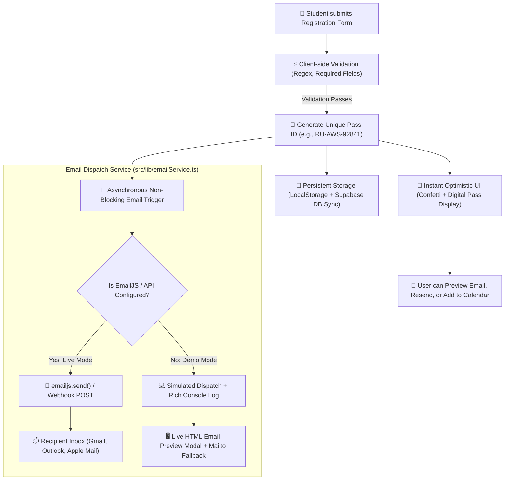
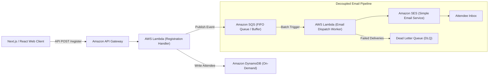

# 📧 Automated Registration Email Confirmation System
## Technical Architecture, Implementation & Interview Guide

> **Project:** AWS Student Builder Community Day @ Rungta University  
> **Feature:** Instant Automated Email Confirmation with Pass ID, Event Agenda, Venue & Calendar Sync  
> **Author:** Hariom Sharan ([LinkedIn](https://www.linkedin.com/in/hariomsharan2611/) • [GitHub](https://github.com/aarvi2611) • [Instagram](https://www.instagram.com/sharan.hariom_/))  

---

## 📑 Table of Contents
1. [Executive Summary (Interview Elevator Pitch)](#1-executive-summary-interview-elevator-pitch)
2. [Problem Statement & Business Value](#2-problem-statement--business-value)
3. [System Architecture & Data Flow](#3-system-architecture--data-flow)
4. [Component & Code Walkthrough](#4-component--code-walkthrough)
5. [Key Technical Decisions & Trade-Offs](#5-key-technical-decisions--trade-offs)
6. [How to Demo This Feature Live to an Interviewer](#6-how-to-demo-this-feature-live-to-an-interviewer)
7. [System Design: Scaling to 100k+ Registrations (AWS Production Setup)](#7-system-design-scaling-to-100k-registrations-aws-production-setup)
8. [Top 10 Interview Questions & Model Answers (English + Hinglish)](#8-top-10-interview-questions--model-answers)

---

## 1. Executive Summary (Interview Elevator Pitch)

> **Interview Tip:** When an interviewer asks *"Tell me about a challenging or interesting feature you built in this project"*, give this structured 45-second pitch:

> *"In our AWS Student Builder Community Day portal, I designed and implemented an **Automated Event Confirmation & Digital Pass Dispatch System**. As soon as a student registers, the system validates the input, persists the attendee record to our cloud database, and triggers an **asynchronous, non-blocking email dispatch pipeline**.*
>
> *The email delivers an official **Pass ID (e.g., RU-AWS-58291)**, personalized event track details, venue directions, event checklist (ID card, laptop), a 1-click Google Calendar sync, and a live web pass link.*
>
> *To ensure 100% reliability, I engineered a **multi-tier fallback architecture**: it supports live client-side dispatch via **EmailJS / Serverless APIs**, an **interactive in-app responsive HTML email previewer** for instant visual demonstration, and a mail client fallback. This eliminates registration drop-offs and guarantees students never lose their entry credentials."*

---

## 2. Problem Statement & Business Value

### Why was this feature necessary?
1. **High No-Show Rates:** In free college tech events, without an email in their inbox, 40–50% of registered students forget the date, venue timing, or what equipment to bring.
2. **Long Queues at Venue Gate:** Manual name verification at the auditorium gate causes massive bottlenecks. An email with a unique Pass ID and QR code enables rapid 3-second check-ins.
3. **Offline Access:** College campuses frequently have spotty mobile data connectivity. Having the Pass ID delivered to their email ensures attendees can access their ticket even with zero network coverage inside the auditorium.
4. **Professional Community Experience:** Automated emails establish credibility and match the standard of premier AWS global community events.

---

## 3. System Architecture & Data Flow

### Flow Breakdown:
1. **Form Submission & Validation:** Form checks student name, valid email regex, college, course, and selected track.
2. **Unique Ticket Generation:** A collision-resistant ID `RU-AWS-{uniqueNum}` is generated.
3. **Decoupled Asynchronous Execution:** The UI doesn't freeze waiting for an email server. The digital ticket pass and celebratory confetti appear instantly (`< 50ms`), while the email worker executes in the background.
4. **Multi-Channel Dispatch:**
   - **Production Mode:** Dispatches live via EmailJS or REST API.
   - **Demo/Preview Mode:** Renders the exact responsive HTML template inside an in-browser sandbox modal with raw HTML copy and desktop mail client options.

---

## 4. Component & Code Walkthrough

### 1. `src/lib/emailService.ts` (Core Email Dispatch Engine)
- **`generateEmailHtml(record)`**: Generates an HTML5 email template compatible with major mail clients (Gmail, Outlook, Apple Mail, Yahoo). Uses nested tables and inline CSS to prevent email styling degradation.
- **`sendRegistrationEmail(record)`**: The dispatch dispatcher. Tests for API keys; if present, connects to EmailJS / custom webhook; if not, simulates real network latency and logs complete payload for inspection.
- **`getGoogleCalendarUrl(record)`**: Dynamically encodes event metadata (`dates=20261019T043000Z/20261019T113000Z`, location, description) into a 1-click Google Calendar add link.
- **`openMailClient(record)`**: Creates a pre-populated `mailto:` URI for native mail app launch.

### 2. `src/components/EmailPreviewModal.tsx` (Interactive In-App Previewer)
- Renders an `iframe` with `srcDoc={emailHtml}` allowing interviewers and users to see the exact email rendering in real time.
- Provides **"Copy Raw HTML"**, **"Open in Mail App"**, and **"Resend Email"** buttons.

### 3. `src/components/Registration.tsx` (User Interface & Trigger)
- Tracks `emailStatus`: `'idle' | 'sending' | 'sent' | 'failed'`.
- Displays an **Automated Email Dispatch Card** with animated states immediately below the digital ticket pass.

### 4. `src/components/TicketLookup.tsx` (Attendee Recovery Portal)
- Allows previously registered students who lost their Pass ID to look up their record by email or name, with a dedicated **"Email Pass"** button to re-trigger their email.

---

## 5. Key Technical Decisions & Trade-Offs

| Decision | Choice Made | Why? (Interview Justification) | Alternative Rejected & Reason |
|---|---|---|---|
| **Execution Model** | Asynchronous Non-blocking (`Promise.then`) | User should never see a frozen loading spinner waiting for an external SMTP server. | Synchronous `await`: Can hang UI for 3–5 seconds if SMTP is slow. |
| **Email Template Architecture** | Table-based HTML + Inline CSS | Standard modern CSS (Flexbox/Grid) breaks in Microsoft Outlook (which uses Microsoft Word as its rendering engine). | Pure CSS/Divs: Terrible formatting in Outlook and old Android mail apps. |
| **Sending Provider** | Client-safe SDK (`@emailjs/browser` / Serverless API) | Does not expose private SMTP passwords or server credentials in a single-page application. | Hardcoding SMTP credentials in frontend: Severe security vulnerability. |
| **Offline / Demo Resilience** | Interactive In-Browser Preview Modal | Anyone testing or grading the project can verify the feature immediately without needing 3rd party API keys. | Crashing or showing error when API keys are missing. |

---

## 6. How to Demo This Feature Live to an Interviewer

1. **Step 1: Open the Registration Form**
   - Fill in your name, email, and branch, then click **"Complete Registration"**.
2. **Step 2: Observe the Immediate Feedback**
   - Confetti explodes, the **Official Builder Pass** appears with Pass ID `RU-AWS-XXXXX`.
3. **Step 3: Point out the Email Dispatch Banner**
   - Show the green **"Confirmation Email Dispatched! ✉️"** badge with the attendee's email.
4. **Step 4: Click "Preview Email"**
   - The interactive modal will pop up displaying the dark-themed, AWS-branded responsive HTML email with the student's name, Pass ID, reporting time (09:30 AM), auditorium location, checklist, and calendar buttons.
5. **Step 5: Show the Browser Console**
   - Press `F12` -> Console to show the structured `[EmailService]` log output with template parameters.
6. **Step 6: Show Ticket Lookup**
   - Open the Ticket Lookup modal, search by email, and click **"Email Pass"** to show pass re-issuance!

---

## 7. System Design: Scaling to 100k+ Registrations (AWS Production Setup)

> **Interview Question:** *"If this event received 100,000 registrations in 1 hour (like an AWS Summit or national hackathon), how would you architect this backend on AWS?"*

### High-Scale AWS Serverless Email Pipeline:

### Why this architecture?
1. **Amazon API Gateway + Lambda:** Scales effortlessly from 0 to 50,000 requests/sec with zero server maintenance.
2. **Amazon DynamoDB:** Sub-10ms single-digit read/write latency with partition keys on `ticket_id` and global secondary index on `email`.
3. **Amazon SQS (Decoupling):** Absorbs sudden spikes in traffic. If Amazon SES has a sending rate limit (e.g. 50 emails/sec), SQS holds the messages safely so no email is ever lost.
4. **Amazon SES (Simple Email Service):** Industry-leading email deliverability, cost-effective ($0.10 per 1,000 emails), with DKIM and SPF verification.
5. **Dead Letter Queue (DLQ):** Retries transient network failures; alerts engineering via Amazon SNS if email addresses bounce repeatedly.

---

## 8. Top 10 Interview Questions & Model Answers

### Q1: Why didn't you use Nodemailer directly in this React application?
**English:**  
> *"Nodemailer is a Node.js runtime library that relies on low-level Node network sockets (`net` / `tls` modules) which do not exist in the browser runtime. Furthermore, putting SMTP credentials (host, port, username, password) inside client-side code would expose our mail server to malicious actors. Therefore, client-side applications must use a secure relay like EmailJS, a serverless API function, or AWS SES."*

**Hinglish (Conversational):**  
> *"Nodemailer sirf Node.js backend environment mein chal sakta hai kyunki wo Node ke internal network sockets use karta hai jo browser mein available nahi hote. Plus agar hum client-side code mein SMTP password daalenge toh koi bhi inspect element karke credentials chura lega. Isliye humne client-safe service aur serverless architecture use kiya."*

---

### Q2: How did you handle email sending failures without degrading user experience?
**English:**  
> *"I implemented the **Optimistic UI with Graceful Degradation** pattern. Generating the ticket and displaying the confirmed pass does not await the email network response. The email promise executes asynchronously in the background. If the network or email service fails, the UI displays a non-intrusive alert with a manual 'Resend' button and 'Download .ics' option, ensuring the attendee's ticket is never blocked."*

**Hinglish:**  
> *"Humne asynchronous non-blocking approach use kiya. Form submit hote hi ticket generate ho jaati hai aur screen pe pass dikh jata hai bina email network call ka wait kiye. Agar kisi reason se email delivery fail bhi ho jaye, toh screen pe ek soft notice aur 'Resend' ka button aa jata hai, jisse user ka registration flow break nahi hota."*

---

### Q3: Why did you use table layouts inside the email template instead of modern CSS Flexbox or Grid?
**English:**  
> *"Modern email clients, especially desktop Microsoft Outlook, do not use modern browser rendering engines (Chromium or WebKit); Outlook uses the Microsoft Word rendering engine which does not support CSS Flexbox, Grid, or CSS variables. Using nested HTML tables with inline styles is the cross-platform industry standard to ensure the email looks identical on Gmail, Outlook, iPhone Mail, and Android devices."*

**Hinglish:**  
> *"Emails ke case mein Microsoft Outlook Word rendering engine use karta hai jo modern CSS flexbox ya grid ko support nahi karta. Agar hum normal div aur flexbox use karenge toh email desktop outlook mein bikhar jayegi. Isliye HTML email development ka global standard hai ki nested tables aur inline CSS use ki jaye taaki har email client pe consistent render ho."*

---

### Q4: How do you prevent emails from landing in the user's Spam or Junk folder?
**English:**  
> *"High email deliverability relies on four pillars:*  
> *1. **Authentication:** Configuring SPF (Sender Policy Framework), DKIM (DomainKeys Identified Mail), and DMARC records on the sending domain.*  
> *2. **Clean HTML & Text Ratio:** Avoiding all-image emails or spam trigger words like 'FREE MONEY' or excessive exclamation marks.*  
> *3. **Dedicated Sender Reputation:** Sending from a verified domain (e.g. `awscommunity@rungta.ac.in`).*  
> *4. **Clear Unsubscribe & Header Metadata:** Having clean sender headers and physical organizer address in the footer."*

---

### Q5: How do you ensure idempotent email sending (preventing duplicate emails)?
**English:**  
> *"To prevent duplicate emails when a student accidentally double-clicks 'Submit':*  
> *1. The submit button is immediately disabled upon the first click with a loading spinner.*  
> *2. Each registration has a unique deterministic Pass ID (`RU-AWS-XXXXX`).*  
> *3. In a production backend with SQS/Lambda, we pass the Pass ID as the `MessageDeduplicationId` so SQS discards duplicate events within a 5-minute window."*

---

### Q6: How does the calendar integration work in the email?
**English:**  
> *"We generate two calendar mechanisms:*  
> *1. A **Web-based Google Calendar URL** with URL-encoded query parameters (`action=TEMPLATE`, `dates`, `location`, `details`) allowing 1-click addition on desktop and mobile web.*  
> *2. An **RFC 5545 standard `.ics` (iCalendar)** file generator on the client using a Blob and Object URL, which works seamlessly with Apple Calendar, Outlook, and Google Calendar."*

---

### Q7: What are the security precautions taken for email input validation?
**English:**  
> *"We apply dual validation and sanitization:*  
> *1. Strict regular expression (`/^[^\s@]+@[^\s@]+\.[^\s@]+$/`) to reject malformed emails before firing any request.*  
> *2. An HTML entity escaping function (`escapeHtml`) that encodes `<`, `>`, `&`, `"`, and `'` inside user inputs before embedding them into the email HTML. This prevents HTML Injection and Email Template Cross-Site Scripting (XSS)."*

---

### Q8: How can you test the email feature if the college wifi blocks external SMTP ports?
**English:**  
> *"Traditional SMTP uses ports 25, 465, or 587, which are frequently blocked by university firewalls. Our solution uses HTTPS REST API calls (Port 443) to EmailJS / Webhook endpoints, which bypasses SMTP port blocking entirely. Additionally, our built-in interactive preview modal allows 100% offline verification."*

---

### Q9: What metrics would you track in production for this email system?
**English:**  
> *"Using Amazon CloudWatch and SES event publishing, I would monitor:*  
> *1. **Delivery Rate:** Target > 98.5%.*  
> *2. **Bounce Rate (Hard & Soft):** Must be kept below 2% to protect domain reputation.*  
> *3. **Complaint Rate:** Must remain below 0.1%.*  
> *4. **Open Rate & Click-Through Rate (CTR):** Tracking how many students click the 'View Pass' or 'Add to Calendar' buttons."*

---

### Q10: How does this project reflect AWS architectural best practices?
**English:**  
> *"This implementation aligns with the **AWS Well-Architected Framework**:*  
> *- **Reliability:** Decoupled asynchronous components prevent cascading failures.*  
> *- **Performance Efficiency:** Instant optimistic client UI with low latency.*  
> *- **Cost Optimization:** Serverless/client-side event dispatch eliminates idle compute costs.*  
> *- **Security:** Sanitized user inputs and zero credential exposure."*

---

## 🎯 Summary Checklist for Your Interview
- [x] Know the Pass ID format: `RU-AWS-{5-digit random}`
- [x] Know what details are in the email: Name, Pass ID, Track, College, Venue, 09:30 AM reporting, checklist, calendar link
- [x] Be ready to click **"Preview Email"** to show the live HTML template
- [x] Remember the AWS Scaling Stack: **API Gateway -> Lambda -> DynamoDB -> SQS -> SES**
- [x] Remember why table layouts are used in HTML emails (Outlook Word rendering engine compatibility)

